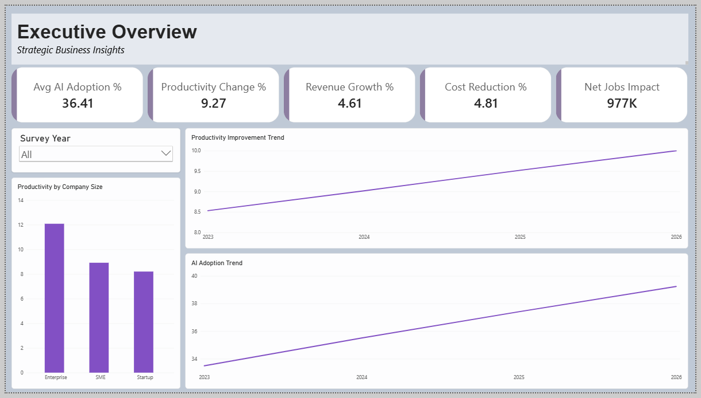
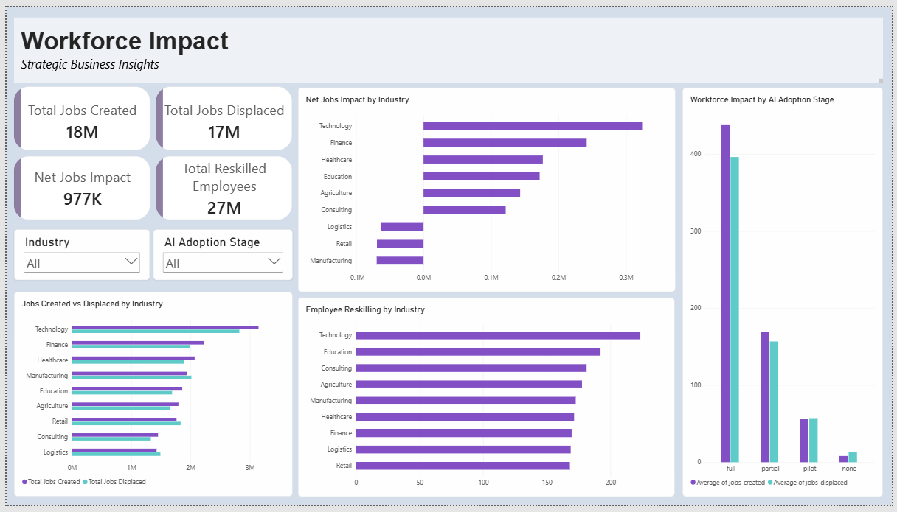

# Global AI Adoption & Workforce Impact Analysis

An end-to-end data analytics project analyzing how AI adoption, investment, and maturity relate to business performance and workforce outcomes across 150,000 company survey records. Built with Python (pandas) for data inspection and validation, SQL (MySQL) for analysis, and Power BI for an interactive 4-page dashboard.

---

## 🎯 Business Problem

Organizations are rapidly adopting AI, but higher adoption does not automatically mean better business or workforce outcomes. Businesses need to understand where AI adoption is strongest, whether greater adoption is associated with higher productivity, and how AI investment relates to revenue, costs, and employment.
This project analyzes AI adoption across companies, industries, company sizes, countries, and adoption stages to answer:
- How effectively are companies converting AI adoption and investment into productivity and business growth?
- Is AI adoption creating net job gains or net job losses, and does that vary by industry?
- Does company size, adoption maturity, or internal governance change the outcome?
- Does a country's digital maturity, AI policy, or economic environment influence company-level adoption and outcomes?

---

## 🗂️ Dataset

The project uses a relational dataset covering company-level survey responses, a country-level reference table, and a pre-aggregated industry benchmark table:

| Table | Records | Description |
|---|---:|---|
| Country AI Index| 30 | Country-level digital maturity, internet penetration, AI policy, patents, and AI researchers|
| AI Company Adoption| 150,000 | Company-level AI adoption, investment, productivity, business, and workforce metrics |
| AI Industry Summary | 9 |  Industry-level reference metrics for AI adoption, productivity, maturity, workforce, and customer outcomes |

**Dataset Source:** [Kaggle](https://www.kaggle.com/datasets/mohankrishnathalla/global-ai-adoption-and-workforce-impact-dataset)

---

## 🛠️ Tools & Technologies

- Python (pandas) — data validation, referential integrity checks, grain confirmation
- SQL (MySQL) — aggregation, window functions, joins, reusable views
- Data Visualization (Microsoft Power BI) — 4-page interactive dashboard with DAX measures

---

## 📊 Dashboard Preview

The final Power BI report contains four interactive analytical pages:

### 1. Executive Overview

Provides a high-level view of AI adoption and its relationship with business performance. The dashboard shows a clear upward trend in both AI adoption and productivity from 2023 to 2026. Average AI adoption increased from approximately 33.5% in 2023 to 39.2% in 2026, while average productivity improvement increased from 8.5% to 10.0%.

### 2. AI Adoption & Business Impact

Examines how AI adoption varies across industries, AI tools, and adoption stages. Technology records the highest average AI adoption at approximately 42.5%, along with the highest average productivity improvement at approximately 11.2%. Companies in the high-adoption group show substantially stronger average productivity, revenue growth, and cost reduction than companies in the low-adoption group.

### 3. Workforce Impact
 

Analyzes the relationship between AI adoption and workforce outcomes. Across the dataset, approximately **17.68 million jobs were created** compared with **16.71 million jobs displaced**, resulting in a positive net job impact of approximately **977,000 jobs**. However, the industry-level results are more mixed. Technology, Finance, Healthcare, Education, Agriculture, and Consulting show positive net job impact, while Logistics, Retail, and Manufacturing show negative net job impact. This highlights that the overall positive workforce impact does not apply equally across all industries.

### 4. Country & Industry Analysis
 

Provides a geographic and benchmark-oriented view of AI adoption. Countries with stronger digital infrastructure and maturity generally appear among the higher-adoption markets in the dataset. Australia, Singapore, the USA, Canada, and New Zealand are among the countries with the highest average company AI adoption. The country-level analysis combines company adoption data with the separate Country AI Index to provide additional context around digital maturity, internet penetration, and AI policy environment.

---

## 💡 Key Insights

1. Adoption maturity is the strongest lever, not tool choice — productivity change scales cleanly with adoption stage (2.39% → 19.79%), while the specific AI tool used barely moves the needle (a <0.4 point spread across all six tools).
2. AI adoption's workforce effect is industry-dependent, not uniformly positive — three of nine industries (Manufacturing, Retail, Logistics) show net job losses even as the overall dataset nets positive, meaning a single blended "AI creates jobs" headline hides real sector-level disruption.
3. Investment and adoption both show a monotonic, tercile-consistent relationship with productivity — moving from the bottom third to top third of either investment or adoption roughly doubles average productivity change, a pattern that held up under percentile-based (not arbitrary) grouping.
4. Country-level policy strictness is a weak standalone predictor of adoption — geographic/economic context does not override differences at the industry and adoption-stage level, and should be treated as a secondary rather than primary driver.

---

## 📌 Business Recommendations

Based on the analysis:

- Organizations should evaluate AI adoption alongside measurable productivity and business outcomes rather than adoption alone.
- Industries experiencing negative net job impact should prioritize employee reskilling and workforce transition programs.
- Companies should monitor AI investment against productivity and financial outcomes to evaluate whether additional investment is generating measurable value.
- Businesses can use adoption-stage analysis to identify opportunities to move from pilot or partial adoption toward more mature AI implementation.
- Digital infrastructure and workforce readiness should be considered when evaluating AI expansion across countries and regions.

---

## 🚧 Limitations

- The dataset is used for analytical and portfolio purposes.
- The analysis identifies associations between AI adoption and business/workforce outcomes and does not establish causal relationships.
- Company-level records represent survey observations and may contain repeated observations for the same companies across different periods.
- AI investment per employee contains a highly skewed upper tail, including extreme values; investment terciles were therefore used for comparative analysis rather than treating the raw average as representative of all companies.
- Country and industry datasets provide reference-level metrics and are not necessarily causal explanations for company-level adoption.
- Workforce figures represent reported/recorded dataset values and should not be interpreted as actual economy-wide employment forecasts.
- The analysis does not include external factors such as company strategy, economic conditions, industry-specific regulation, AI implementation quality, or macroeconomic changes.
- AI tool comparisons are observational and should not be interpreted as controlled comparisons of tool effectiveness.

---
